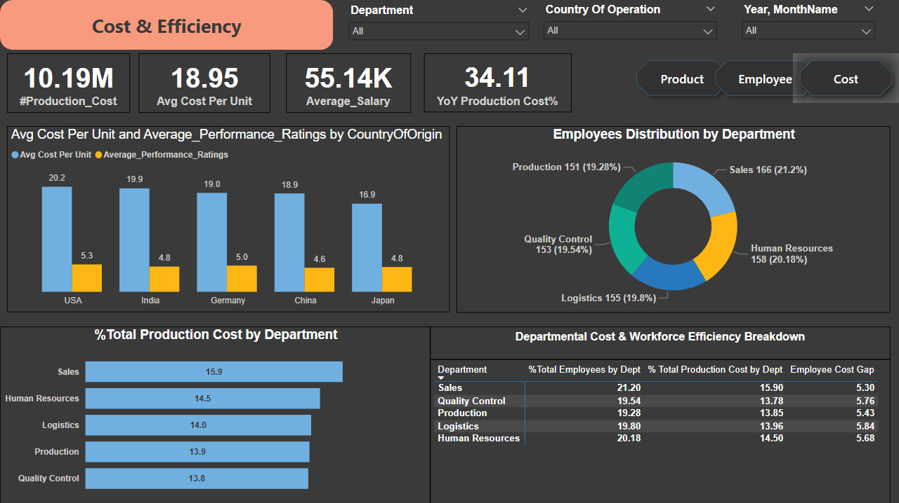

# **Manufacturing Efficiency Analysis Dashboard**

## **Overview**
This project analyzes manufacturing production data and employee performance metrics to uncover key insights that help streamline operations, reduce costs, and enhance workforce efficiency. By utilizing Power BI, the goal is to create a comprehensive dashboard that visualizes trends in production costs, employee performance, and departmental efficiency. The project aims to support decision-making by providing actionable insights to manufacturing firms.

## **Skills & Technologies Used**
- **Power BI**: Data visualization and dashboard creation  
- **DAX (Data Analysis Expressions)**: Advanced calculations and metrics

## **Objective**
The objective of this project is to:
- Analyze production and employee performance trends.
- Understand the relationship between production costs, employee performance, and departmental efficiency.
- Develop an interactive Power BI dashboard that provides actionable insights to optimize manufacturing operations and workforce performance.

---

## **Insights & Recommendations**

### **Production Dashboard Insights**  
---

#### **Production Cost and Quantity Produced Trend**  
---
- **Production Cost (2025)**: Dropped from $3.85M → $2.59M, but unit cost stayed flat (~$18.9/unit), suggesting no major efficiency gains.
- **Quantity Produced**: Fell sharply from 202K → 137K, indicating a possible operational disruption.

**Recommendations**:
- Investigate equipment, supply chain, or workforce issues.
- Implement overtime, shift planning, or temporary outsourcing.
- Focus on cutting waste, renegotiating suppliers, and auditing energy consumption.
- Set alerts for production drops and cost spikes to ensure early detection of issues.

#### **Total Warehouse Contribution**  
---
- **Top Performers**: West (26.1%), East (25.71%)
- **Underperformer**: South (23.06%)

**Recommendations**:
- Investigate low output in the South warehouse and replicate processes from the West and East.
- Upskill the South warehouse team based on the standards set by the top-performing locations.
- Assess whether any tools or technologies are lacking in the South warehouses.

#### **Production Across Country of Origin**  
---
- **Top Performers**: USA & Germany, likely due to advanced automation and strong operational processes.
- **Underperformers**: India & China are underperforming, though not drastically.
- **Lagging**: Japan has the lowest performance, possibly due to structural or capacity issues.

**Recommendations**:
- Benchmark operations in the USA and Germany to identify successful processes, technologies, and automation.
- Invest in workforce development and automation in underperforming regions (Japan, China, India) to improve performance.
- Close gaps in automation and robotics, especially in countries showing lower output.

#### **Product Cost Across Product Type**  
---
- **Automobile and Textiles** are the biggest cost drivers.
- **Machinery** has the lowest production cost, indicating operational efficiency or lower volume.

**Recommendations**:
- Furhter Investigating , Are raw materials, labor, or logistics driving costs.
- Re-evaluate vendors and materials for cost-heavy products.
- Assess automation opportunities in Textiles & Furniture to lower recurring costs.

#### **Cost Per Unit Across Products**  
---
- **Automobiles** have the highest unit cost, possibly due to complex components, higher labor, or longer cycle times.
- **Machinery, Furniture, and Electronics** maintain a lean cost per unit of ~$18.8.

**Recommendations**:
- Increase automation in Textiles & Automobiles to bring unit costs down.
- Implement best practices from Machinery across other product types.
- Monitor production closely to spot inefficiencies.

---

### **Employee Performance Dashboard Insights**  
---

#### **Employee Across Departments**  
---
- **Sales** (21.2%) and **Human Resources** (20.18%) have the highest headcount.
- **Production** has the lowest headcount (19.28%).

**Recommendations**:
- Ensure resource allocation matches workload and strategic goals, especially in Sales and Logistics.
- Reassess staffing needs in Production and Quality Control if performance is impacted.

#### **Average Salary by Year**  
---
- Average salary has been decreasing over time:
  - 2020: $55,706
  - 2021: $54,772
  - 2022: $54,042

**Recommendations**:
- Monitor employee morale and retention—declining pay may affect motivation.
- Conduct pay audits to ensure competitiveness and fairness.

#### **Average Performance Ratings by Department**  
---
- **Logistics** leads with an average rating of 5.4.
- **Sales** has the lowest average rating at 4.5.

**Recommendations**:
- Recognize and replicate best practices from Logistics.
- Investigate root causes of low ratings in Sales (training, leadership, workload, etc.).

#### **Tenure-wise Average Performance**  
---
- Performance improves with tenure:
  - 3–4 years: 4.7
  - 4–5 years: 4.9
  - 5+ years: 5.2

**Recommendations**:
- Prioritize retention strategies—experienced employees perform better.
- Create mentorship programs to transfer knowledge from senior employees.

#### **Performance Rating Across Country of Operation and Department**  
---
- **Germany (Production)** has the highest performance rating (5.73).
- **USA (Sales)** has the lowest (4.12).

**Recommendations**:
- Study Germany’s production practices and consider applying them globally.
- Address performance issues in USA Sales through training or leadership review.

#### **Department-wise Low Performance High Salary Employees**  
---
- High-salary employees with low ratings (as low as 1.0) found across departments, especially in **Sales, Logistics, and Production**.

**Recommendations**:
- Conduct performance reviews and create action plans for underperforming high-cost employees.
- Explore role reassignment or development plans before considering exits.
- Align compensation with clear KPIs and performance outcomes.

---

### **Cost & Efficiency Dashboard Insights**  
---

#### **Avg Cost Per Unit and Performance Ratings by Country**  
---
- **USA**: $20.2, **India**: $19.9, **Germany**: $19.0 (high cost per unit)
- **Japan**: Lowest cost per unit at $16.9 but moderate performance (4.8).
- **China**: Shows low performance despite not having the lowest costs.

**Recommendations**:
- Investigate cost structures in the USA, India, and Germany to assess if high labor or material costs are driving unit expenses.
- Benchmark Japan’s operations to identify potential efficiency gains in other countries.
- Address performance issues in China to ensure the cost justifies the output value.

#### **Departmental Cost & Workforce Efficiency Breakdown**  
---
- **Sales** and **Production** are the most cost-effective departments.
- **Logistics** and **Quality Control** have the highest cost gaps, suggesting inefficiencies.
- **Human Resources** has a large headcount but contributes less to costs, indicating a potential for process optimization.

**Recommendations**:
- Leverage the best practices from **Sales** & **Production** to improve other departments.
- Optimize **Logistics** & **Quality Control** by addressing inefficiencies or exploring automation opportunities.
- Streamline **HR** operations through automation or restructuring to improve cost-to-headcount efficiency.

---

## **Contact**
For any questions or collaboration inquiries, feel free to reach out at vishnub195@gmail.com
